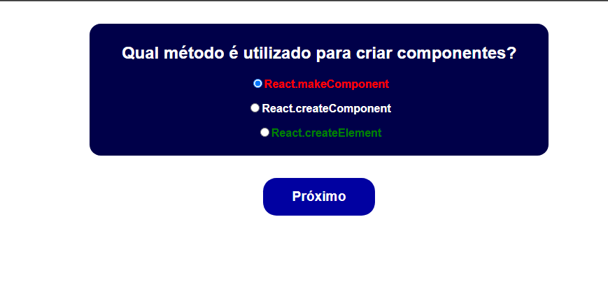
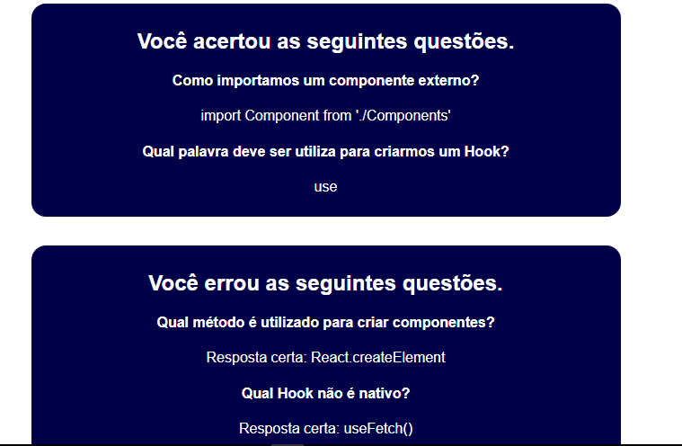

# Questionário

Este `projeto` foi desenvolvido com `React` para fim de melhorar ainda mas as minhas habilidades em `React`. É um simples `questionário` com quatro perguntas voltadas a programção.

O projeto mostra assim que usuário escolher a optição que achar correta o sistema vai pintar na optição correta com color verde e a incorreta com vermelha e no final que usuário ter respondido todas as perguntas o programa vai `mostrar` todas as `informações` especialmente quantas perguntas o usuário acertor e errou.

## Tecnologias

As seguintes ferramentas foram usadas na constuição deste projeto:

- HTML
- CSS
- REACT

#

Feito por Pascoal Kahamba meu [Linkedin](https://https://www.linkedin.com/in/pascoal-kahamba-7b43bb233?lipi=urn%3Ali%3Apage%3Ad_flagship3_profile_view_base_contact_details%3BTg8LEKayToyytOX1pVAQ%2Bg%3D%3D)

[👉Clique aqui para rodar o projeto👈](https://pascoal-questions.vercel.app/)😎
